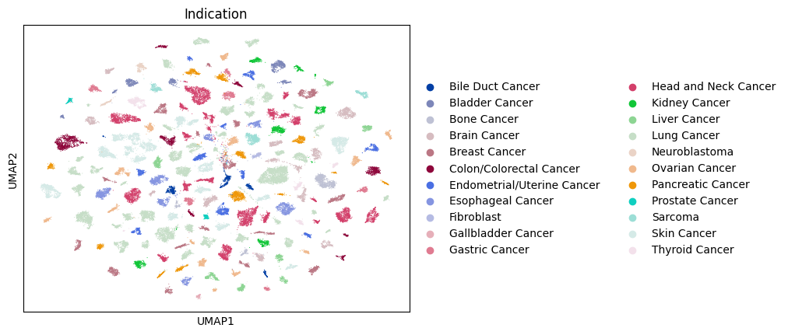
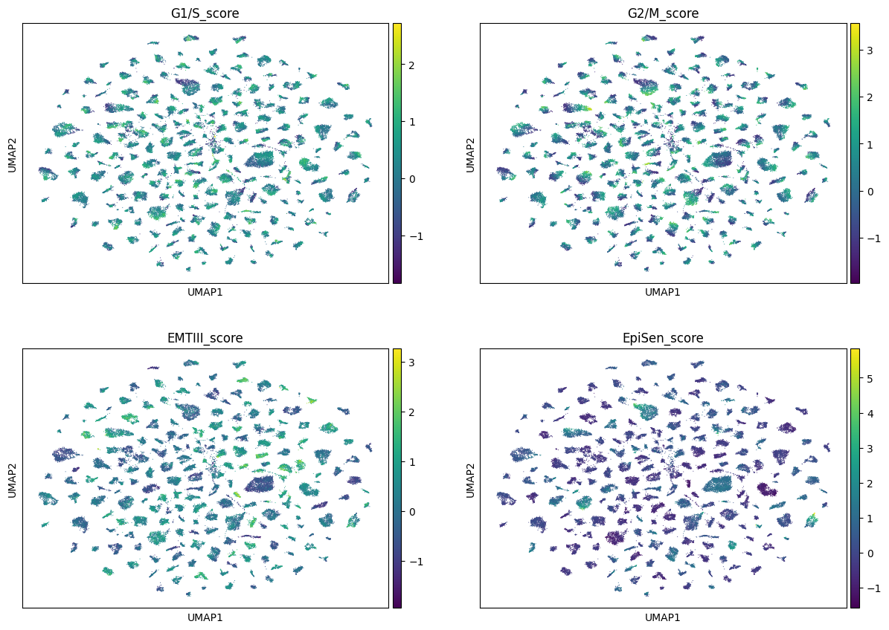
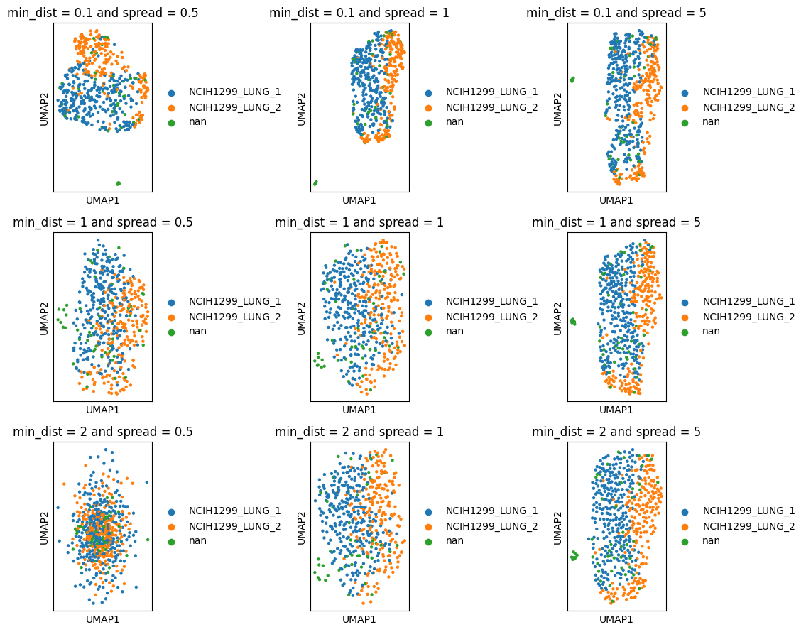
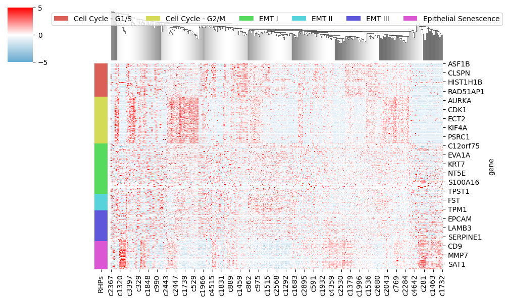

## F1L_emulator_2024: Exploring scRNA-seq expression heterogeneity among cancer cell lines


This repo is for tracking the progress on the F1L internship emulator based on Fiugre One Lab Dean Lee's LinkedIn articles. The progress will be first commited to the `dev` branch and pushed to the `main` branch when it reaches a certain milestone such as a completion of notes, scripts, etc.

You can find memos on various topics here in `README.md`. This memo is not meant to be a literature review. It is to invoke some thoughts and perspectives to accompany the topics discussed here.

**References to Dean Lee's articles**

- [X] [Week 1](https://www.linkedin.com/pulse/week-1-f1l-internship-emulator-ksq-dean-lee-354ke/)
- [X] [Week 2](https://www.linkedin.com/pulse/week-2-f1l-internship-emulator-paper-dean-lee-3crce/)
- [X] [Week 3](https://www.linkedin.com/pulse/week-3-f1l-internship-emulator-data-dean-lee-h83qe/)
- [X] [Week 4](https://www.linkedin.com/pulse/week-4-f1l-internship-emulator-biology-dean-lee-ja4me/)
- [ ] [Week 5](https://www.linkedin.com/pulse/week-5-f1l-internship-emulator-slides-dean-lee-qqufe/)

## Week 1 - The Key Scientific Question (KSQ)

The KSQ: Using available scRNA-seq data from cancer cell lines, how would you explore the use of the following FDA-approved antibody therapies in additional cancers?
* Trastuzumab: Targets HER2 and is used in the treatment of HER2-positive breast and gastric cancers.
* Bevacizumab: Targets VEGF and is used for a variety of cancers, including colorectal, lung, glioblastoma, breast, liver, and kidney cancer.

#### <code style="color : LightSkyBlue">Quick info on these mAb's targets</code>
* HER2 is a member of the human epidermal growth factor receptor, a plasma-membrane-bound receptor tyrosine kinase (Gene name: *ERBB2*, Uniprot_ID: P04626). Activation of HER2, usually via homo/heterodimerization with EGFR, promotes cell proliferation. Overexpression or gene amplification of HER2 occurs in ~14% of breast cancer ([NIH Cancer Stat Facts](https://seer.cancer.gov/statfacts/html/breast-subtypes.html))

* VEGF stands for Vascular endothelial growth factor. VEGF binds to a tyrosine kinase VEGF receptors which is known to promote angiogenesis. Angiogenesis is a crucial step for tumorigenesis.

#### General thoughts
Cancer cells are known to exist in heterogenous subpopulations. Using scRNA-seq, we can hope to capture the information about their heterogeneity based on their transcriptional states. 

In the context of drug discovery and development, scRNA-seq can reveal important signatures for identifying which types of cancer cell subpopulation respond to treatment.
* scRNA-seq can argue for some subpopulation of cells defined by a consensus transriptional states. Let's call these intrinsic factors (e.g., presence-or-absence of gene expression, varying level of gene expression)
* Transcriptional states may change based on external factors such as tumor microenvironment, cell-matrix interactions, treatment, metabolic states, etc.
* Therefore, one may simply hypothesize that any two subpopulations from distinct cell types whose transcriptional programs are similar enough may have similar responses to the same external factor.
* How effective is the treatment against various cancer cell types and their subpopulation?
    * This can be done by first identifying the cell type and subpopulation from the scRNAseq data, typically by clustering using some known markers (displayed on t-SNE, UMAP). Then, you perform differential gene expression, typically by a linear mixed model.
* How does the level of target expression affect the treatment outcomes (phenotypes, survival, etc)?
    * You can perform feature selection to select certain genes to correlate with phenotypes, used as a variable in survival analysis. In addition, you can project/group them into eigengenes with tools like `WGCNA`. Generally, eigengenes are usually overrepresented by co-expression or co-regulated components.

Good experimental designs can help help counteract some "artificial" confounding factors based on experimentation.
* Are the cell lines representative of cancer states? Were they cultured as suspension, monolayer, 2D, 3D-organoids, in-vivo, patient-dervied xenografts, etc? Do we need to account for the donor's genomic landscapes? There are a lot of things to think about here. An ideal experiment must balance between feasibility, needed resources, and context. It should also have appropriate controls. For example, gene expression in cell lines may not perfectly recapitulate cancer cells in vivo but they could offer a well-controlled experiment. On the other hand, cells harvested directly from a patient tumor may not be representative because it is extremely difficult to ascertain various confounding factors from patient life experience. Two patients may have very different lifestyles, genetic background, etc.
* How were experiments conducted? How many batches are there? Were samples and batches randomized? How many people conducted the experiments? Were hands accounted for in the experimental design? 
* Genomic instability has been shown to be a part of many cancer cell types. Culture passages may change the "baseline" gene expression even for the same cell line.  
* What are the scRNA platform used? Are all ingested data harmonized and accounted for cross-platform data?

#### One way to think about the KSQ:
If we have scRNA-seq data from an experiment where Trastuzumab or Bevacizumab was used to treat a specific cancer cell line (each treatment has its own vehicle control), alongside another dataset of untreated scRNA-seq from different cancer cell lines, can we draw conclusions about the effectiveness of these treatments on the untreated cell lines?

## Week 2 - Kinker et al
This week, we are assigned to read a paper Pan-cancer single-cell RNA-seq identifies recurring programs of cellular heterogeneity by Kinker et al. This gives us a bit more context for the KSQ. 

#### My brief summary
The authors hypothesized that there could some intrinsic properties shared among cancer cells that could explain intratumor heterogenity in the absence of tumor microenvironments. To tackle this question, they conducted single-cell RNAseq experiments profiling 9 pools of cancer cell lines. Each of the eight pools is a mixture of 24-27 cell lines with similar proliferation rates from the Cancer Cell Line Encyclopedia (CCLE) collection. One additional customed pool includes head and neck squamous cell carcinoma (HNSCC) cell lines. They found that there exists recurrent heterogeneous programs (RHPs) of gene expression (clusters of genes  shared by many types of cancer). The authors then highlighted several functional annotations of the RHPs. Following the overall description of RHPs, the authors chose to focus on Epithelial Senescence (EpiSen) program which are preferentially observed in G0 cells such as HNSCC cell lines. They isolated and experimented on high and low-EpiSen HNSCC cells and demonstrated these two subpopulation elicits distinct sensitivities to pharmacological treatment.

#### Some questions asked by Dean
* How did the authors handle the potential caveat of co-culturing cell lines before profiling by scRNA-seq? Why do you think that caveat was or was not adequately addressed?
    * The authors acknowledged that cells in CCLE pools were co-cultured for 3 days. During this time, co-culturing may alter gene expression, which may alter their results if cells were not co-cultured. They demonstrated that this effect is minimal by examples. Specifically, in their control experiment, they showed that 6 cells line +/- co-culturing show similar gene expression. 
* The authors identified discrete subpopulations of cells within a subset of individual cell lines (Fig. 2A-B). What might be the reason why some cell lines have these discrete subpopulations while others do not?
    * The authors reported that discrete clusters were found in 11% of the cell lines. With the copy number abberration analysis dividing cell lines into genetic subclones, they found that associations between genetic subclones and discrete clusters. Therefore, they suspected that genetic mechanism is partly why some cell lines have discrete subpopulatioon.
* What are Recurrent Heterogeneous Programs (RHPs) and how were they defined?
    * First, NMF was used within each cell line as a method of dimensional reduction to generate NMF expression patterns which are characterized by top 50 genes that make up each NMF. Note each cell usually have a few NMF. Then, hierarchical clustering of NMF using Jaccard similarity tells us "how well a pair of NMF shares genes". These values were used to help define Recurrent Heterogeneous Programs (RHPs).
    * Therefore, think of RHPs as gene clusters (defined by NMF) that are present in many cell lines.
* How do the identified RHPs relate to in vivo programs of heterogeneity in tumors, and what evidence supports this relationship?
    * They compared the in vitro RHPs with the previously measured in vivo RHPs from patient tumors. Using hypergeometric test among gene signatures between in vitro and in vivo RHPs, they found a significant similarity. Therefore, they inferred that these in vitro heterogeneity resemble that of in vivo.
* Where can you download the scRNA-seq data as shown in Figure 1B?
    * I downloaded `Metadata.txt` and `UMIcount_data.txt` from https://singlecell.broadinstitute.org/single_cell/study/SCP542/pan-cancer-cell-line-heterogeneity#study-download

## Week 3 - Scanpy with Kinker et al data

Usually the best practice for version control a Python project is to create a virtual env for each project. You may also share the venv across projects. Because analyzing scRNA-seq data is memory intensive, I'll use google colab notebook for data analysis with pre-installed packages.

This week, I will follow Dean Lee's notebook templates to re-enact figure 1 from Kinker et al. I made necessary changes to make sure that these codes can be run end-to-end in google colab environment.
* `240701_kinker_anndata.ipynb`
* `240702_kinker_scanpy.ipynb`
* `240703_kinker_explore.ipynb`

For data download directly in Colab session, run this code below:
```
# After signing into SCP, generate temporary curl download link with 'Bulk download
# The auth_code token can only be used once
!curl --insecure "link_from_SCP" -o cfg.txt

# Search for Metadata.txt and UMIcount_data.txt
! mkdir Data
! grep "Metadata.txt" cfg.txt | grep -oP 'url="[^"]+"' | sed 's/url="//;s/"$//' | \
  xargs -I {} wget --quiet -O Data/Metadata.txt {} || echo "Download failed"

! grep "UMIcount_data.txt" cfg.txt | grep -oP 'url="[^"]+"' | sed 's/url="//;s/"$//' | \
  xargs -I {} wget --quiet -O Data/UMIcount_data.txt {} || echo "Download failed"

# List the Data directory for confirmation
! ls -la Data/
```

**Re-enact Figure 1**
* By the time you get to the end of `240702_kinker_scanpy.ipynb`, you should have produced a UMAP plot, a 2-D visualization of the scRNA-seq dataset. Does this look like Figure 1B of Kinker et al.? How is it similar? How is it different? Take notes directly in your Jupyter notebook.

<code style="color : LightSkyBlue">The UMAP plotted here appears different than Figure 1B of Kinker et al. Figure 1B is in fact a t-SNE plot. Therefore, the two different dimensionality reduction methods should produce different results. </code>

* Now color the dots in the UMAP plot by the different columns of the metadata. What patterns do you see? Do they make sense? Take notes directly in your Jupyter notebook.


* Now for the challenge. Try to reproduce Figure 2B and 2D from Kinker et al. See if you can recapitulate some of the patterns in the data that the authors describe. Do your best, but don’t lose any sleep over this.

    * I try to re-optimize UMAP parameters to try to match Figure 2B. You can see that a similar pattern is observed for NCIH1299 cell line.
    

    * To replot the heatmap, I first looked for genes that made up the RHPs (Supplementary table 4). Then, I plotted the heat with only column clusters (clustering cell by their expression). You can see a similar pattern in expression and clustering for G1/S, G2/M, and EpiSen RHPs.
    

## Week 4 - Revisit KSQ
The KSQ: Using available scRNA-seq data from cancer cell lines, how would you explore the use of the following FDA-approved antibody therapies in additional cancers?

**Trastuzumab:** Targets HER2 and is used in the treatment of HER2-positive breast and gastric cancers.
* My analysis shows that the top two cell types with highest ERBB2 expression are consistent with the current usage of Trastuzumab for treating breast and gastric cancer.
```
Top 5 Cell Lines with Highest Mean Expression for ERBB2:                                      
Gene  Indication                  Mean        
ERBB2 Breast Cancer               0.646870
      Gastric Cancer              0.395268
      Colon/Colorectal Cancer     0.169279
      Endometrial/Uterine Cancer  0.163754
      Esophageal Cancer           0.108442
```
* After examining closer, cell lines within cancer cell types typically shows various levels of ERBB2 expression. For example, HC1419 and EFM192A show highest ERBB2 expression among breast cancer cell lines while MKN7 has the highest expression for gastric cancer.
* Next, I generated pseudobulk expression for each cell line by combining single cells from each cell line together. This should reduce dropouts in the expression matrix for a more robust assessment of gene coexpression using correlation.
    * When I used all genes for assessing coexpression, cell lines are unsurprisingly clustered by cancer cell type.
    * When I used only genes that are involved in ERBB2 signaling (based on a reference gene set in Biomart), those genes in the same signaling pathway are highly coexpressed. In fact, MKN7, HC1419 and EFM192A are all found in the same cluster.
    * I can propose a simple hypothesis. Cell lines that show similar coexpression of ERBB2 signaling pathway genes to MKN7, HC1419 and EFM192A could be sensitive to Trastuzumab treatment. Based on this idea, RCM1 large intestine cell line could be one candidate for testing Trastuzumab treatment in Colorectal Cancer.

| Cell line A | Cell line B | Correlation |
|-----------------|-----------------|--------|
|10_EFM192A_BREAST|10_HCC1419_BREAST|0.964684|
|10_MKN7_STOMACH|10_HCC1419_BREAST|0.854928|
|10_HCC1419_BREAST|22_RCM1_LARGE_INTESTINE|0.508674|
|10_HCC1419_BREAST|9_MFE280_ENDOMETRIUM|0.500096|

**Bevacizumab:** Targets VEGF and is used for a variety of cancers, including colorectal, lung, glioblastoma, breast, liver, and kidney cancer.


